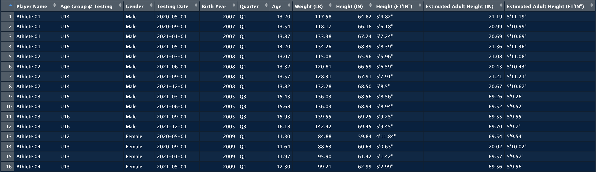
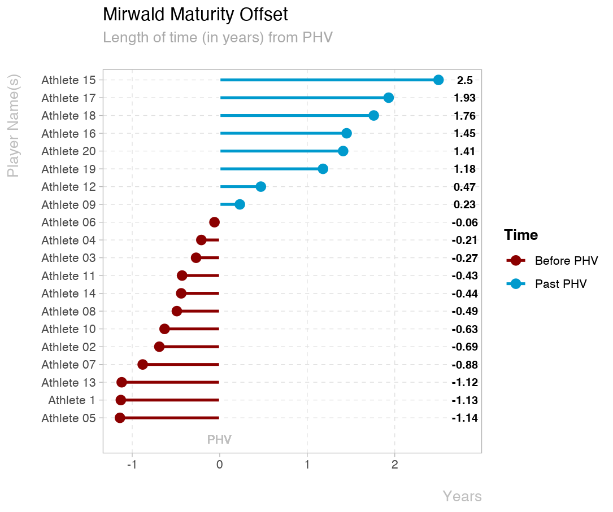
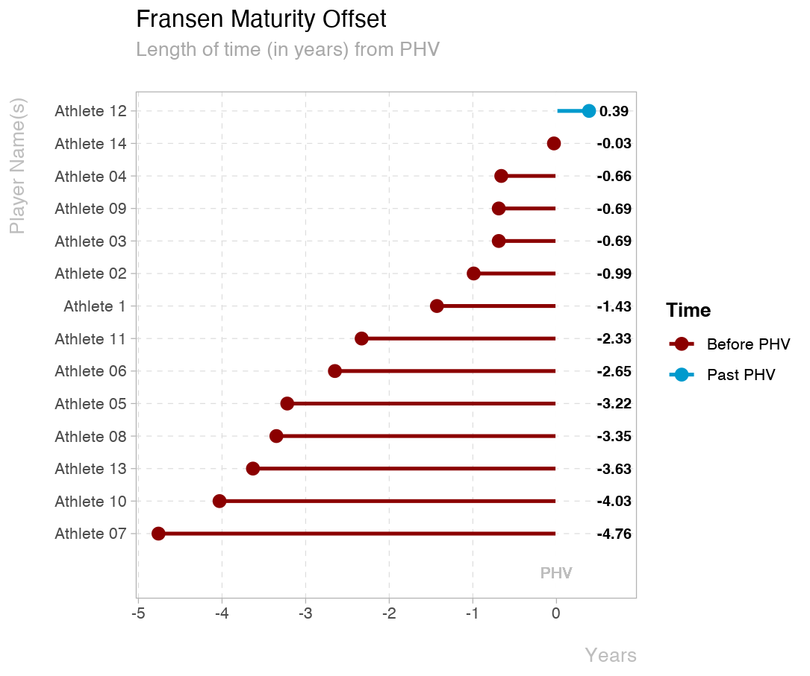

[](https://opensource.org/licenses/BSD-3-Clause)
[](https://www.repostatus.org/#active)

# {ageR}
### Athlete Growth &amp; Maturation

## Intro

The identification and development of talented young football players is a primary focus of all professional football academies around the world (1). However, it becomes more difficult to assess adolescent players development when they experience the non-linear tempo and timing of their maturational growth spurt (2). Hence, it has become increasingly important to monitor athletes growth and maturation in order to minimize growth related injuries as well as allow for better adjustments of training and competition exposure (1). Non-invasive measures have become increasingly used within team sports as it provides practitioners with a practical, cost and time effective way of assessing maturation within a large team setting (3;4).

The goal of this repository is to showcase {ageR}, a package that provides the framework for professionals working with young athletes to calculate and visualize common non-invasive maturation metrics. The non-invasive methods implemented in this package are:

**Predicted Age at Peak Height Velocity (PHV):** The two methods used to calculate this metric are based on research from Mirlwald et al. (2002) and Fransen et al. (2018), using the following measurements:

* gender
* date of birth
* date of measurement
* height (cm)
* sitting height (cm)
* weight (kg)

**Predicted Adult Height (PAH):** This is based on the Khamis-Roche method and uses the following measurements:

* age
* gender
* height (cm)
* weight (kg)
* mother height (cm)
* father height (cm)

## Installation

```
# Install from GitHub  
install.packages("devtools")
devtools::install_github("a-kikhia11/ageR")
```

## Data Collection
Usable data must follow the same template as the **data_sample** sheet supplied within the package. Ensure that there are no blank fields within the dataset. 

**{ageR}** provides two Maturity Offset calculation methods (Mirwald and Fransen) as well as the Khamis-Roche method in the same dataset

**Note** the Fransen method is only applicable to **Males**

### Sample Data / Template

```
library(ageR)

data_sample
```

## Usage

### Data Frames:
The two main functions within the package are *`maturation_cm()`* and *`maturation_in()`*. Both functions perform the same calculations, however the units are different. The function takes the raw data from the template and performs the Khamis-Roche, Mirwarld, and Fransen calculations returning a dataframe that users can manipulate for further analysis.

```
library(ageR)

maturation_cm(data_sample)
```


```
library(ageR)

maturation_in(data_sample)
```



### Plots:
**{ageR}** provides several visualization options:

**Predicted Adult Height Plot** (note the three options depending on centimeters, inches, or feet and inches)

```
library(ageR)

plot_PAH_cm(data_sample)
```


```
library(ageR)

plot_PAH_in(data_sample)
```


```
library(ageR)

plot_PAH_ftin(data_sample)
```


**Time to PHV Dumbell Plot** (note the two options for calculating Time to PHV, Mirwald and Fransen)

```
library(ageR)

plot_time2phv_Mirwald(data_sample)
```


```
library(ageR)

plot_time2phv_Fransen(data_sample)
```


**Maturity Offset Plot** (note the two options for calculating Maturity Offset, Mirwald and Fransen)

```
library(ageR)

plot_MatOffset_Mirwald(data_sample)
```



```
library(ageR)

plot_MatOffset_Fransen(data_sample)
```



**Plot Current and Predicted Height of an Athlete against Normal Growth Curves** (must specify the athlete, reference sample, and gender)

```
library(ageR)

plot_growthcurve(data_sample, "Athlete 08", "UK", "Male")
```


```
library(ageR)

plot_growthcurve(data_sample, "Athlete 17", "US", "Female")
```


**Plot % Adult Height against Maturity Offset**
(note the two options for calculating Maturity Offset, Mirwald and Fransen. Maturity stages are further highlighted within the graphs)

```
library(ageR)

plot_MatStages_Mirwald(data_sample)
```


```
library(ageR)

plot_MatStages_Fransen(data_sample)
```


## Considerations

Users should be aware of the validity and reliability of non-invasive measures to better interpret results (4). Furthermore, these methods have been validated within specific populations, and professionals using it with athletes from different countries and ethnicities should pick the correct reference population where possible and be cautious when interpreting results.

## Acknowledgments

This package was built and improved upon the foundations laid by Jose Fernandez and Jorge Arede's matuR package (8).

## References

**1.** Cumming SP, Lloyd RS, Oliver JL, Eisennnann JC, Malina RM. Bio-banding in sport: Applications to Competition, talent identification, and         strength and conditioning of youth athletes. Strength and Conditioning Journal. 2017;39(2):34–47.

**2.** Malina RM, Rogol AD, Cumming SP, Coelho-E-Silva MJ, Figueiredo AJ. Biological maturatioon of youth athletes: assessment and implications.        British Journal of Sports Medicine. 2015;49:852-859.

**3.** Towlson C, Salter J, Ade J, Enright K, Harper L, Page R, Malone J. Maturity-associated considerations for training load, injury risk, and        physical performance within youth soccer: One size does not fit all. Journal of Sport and Health Science. 2020.

**4.** Salter J, Cumming S, Hughes JD, De Ste Croix M. Estimating somatic maturity in adolescent soccer players: Methodological comparisons.            InternaGonal Journal of Sports Science & Coaching. 2021;17(1):11–17.

**5.** Khamis HJ, Roche AF. Predicting adult stature without using skeletal age - The Khamis-Roche method. Pediatrics. 1994;94(4):504–507. (See         erratum in Pediatrics 1995;95:457.)

**6.** Fransen J, Bush S, Woodcock S, Novak A, Deprez D, Baxter-Jones ADG, Vaeyens R, Lenoir M. Improving the prediction of maturity from               anthropometric variables using a maturity ratio. Pediatr Exerc Sci. 2018;30(2):296–307.

**7.** Mirwald R.L., Baxter-Jones A.D.G., Bailey D.A., & Beunen, G.P. An assessment of maturity from anthropometric measurements. Medicine and          Science Sports Exercise. 2002;34(4):689–694.

**8.** Jose Fernandez (2020). matuR: Athlete Maturation and Biobanding. R package version 0.0.0.9000. https://github.com/josedv82/matuR

## Citing this package

```
To cite the package ‘ageR’ in publications, use:

  Abdurrahman Kikhia (2023). ageR: Athlete Growth & Maturation. R package version 0.1.0.
  https://github.com/a-kikhia11/ageR
```
